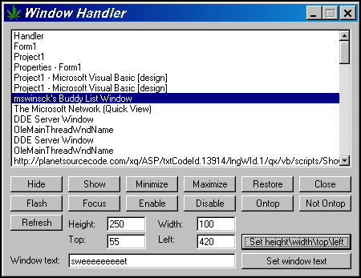



## Handler

### Description

The ultimate window handler, this can Hide\Show\Minimize\Maximize\Restore\Close\Flash\Focus\Enable\Disable\Ontop\Not Ontop\Set Height and Width, Top\Left And set window text!!! Vote if you like this code!!!
 
### More Info
 

             |
---                |---
**Submitted On**   |2000-12-28 11:02:44
**By**             |[sck](https://github.com/Planet-Source-Code/PSCIndex/blob/master/ByAuthor/sck.md)
**Level**          |Intermediate
**User Rating**    |5.0 (65 globes from 13 users)
**Compatibility**  |VB 4\.0 \(16\-bit\), VB 4\.0 \(32\-bit\), VB 5\.0, VB 6\.0
**Category**       |[Miscellaneous](https://github.com/Planet-Source-Code/PSCIndex/blob/master/ByCategory/miscellaneous__1-1.md)
**World**          |[Visual Basic](https://github.com/Planet-Source-Code/PSCIndex/blob/master/ByWorld/visual-basic.md)
**Archive File**   |[CODE\_UPLOAD1312712282000\.zip](https://github.com/Planet-Source-Code/sck-handler__1-13914/archive/master.zip)

